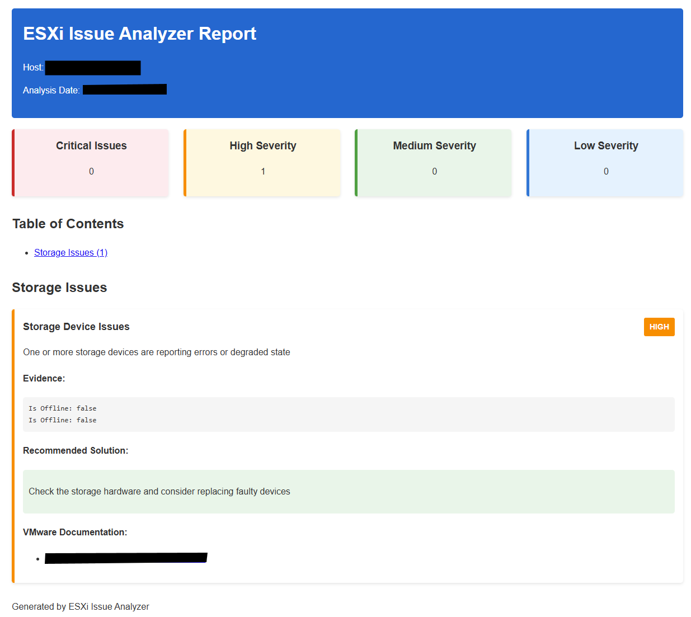

# ESXi Issue Analyzer

An automated tool that diagnoses and suggests solutions for common VMware ESXi server problems.



## Features

- **Automated Log Collection**: Connects to ESXi hosts via SSH to collect system logs and configuration information
  - Password and SSH key authentication support
  - Automatic retry with exponential backoff
  - Configurable timeouts and connection settings
- **Comprehensive Analysis**: Analyzes performance metrics, hardware status, VM states, and network configurations
- **Issue Detection**: Automatically identifies common issues such as:
  - Storage failures and high latency
  - High CPU/memory utilization
  - Network configuration problems and errors
  - Hardware sensor warnings
  - VM state issues and snapshot problems
  - ESXi version and security concerns
- **Detailed Reporting**: Generates HTML reports with:
  - Issue severity classification (Critical, High, Medium, Low)
  - Evidence and context for each detected issue
  - Specific troubleshooting steps based on VMware best practices
  - Links to relevant VMware Knowledge Base articles
- **Dual Interface**: Supports both command-line and web-based interfaces
- **Advanced Features**:
  - Configurable thresholds via YAML configuration
  - Professional logging with rotation
  - Type-safe code with full type hints
  - Improved error handling and recovery

## Installation

1. Clone this repository:
   ```
   git clone https://github.com/yourusername/esxi-analyzer.git
   cd esxi-analyzer
   ```

2. Install the required dependencies:
   ```
   pip install -r requirements.txt
   ```

3. Make the main script executable (Linux/Mac):
   ```
   chmod +x esxi_analyzer.py
   ```

## Configuration

The analyzer can be configured using the `config.yaml` file. Copy and customize it to adjust thresholds, SSH settings, and logging behavior:

```yaml
# Analysis Thresholds
thresholds:
  high_latency_ms: 20.0              # Storage latency threshold
  low_datastore_space_percent: 10    # Datastore free space warning
  high_cpu_percent: 80               # CPU utilization threshold
  high_memory_percent: 90            # Memory usage threshold
  max_uptime_days: 180               # Maximum uptime before warning
  max_snapshot_age_days: 3           # Snapshot age threshold

# SSH Connection Settings
ssh:
  timeout: 30                        # Connection timeout in seconds
  command_timeout: 60                # Command execution timeout
  retry_attempts: 3                  # Number of retry attempts
  retry_delay: 2                     # Initial retry delay in seconds
  verify_host_keys: true             # Enable host key verification
  use_key_auth: false                # Use SSH key authentication
  key_file: "~/.ssh/id_rsa"         # Path to SSH private key

# Logging Settings
logging:
  level: "INFO"                      # DEBUG, INFO, WARNING, ERROR, CRITICAL
  log_file: "esxi_analyzer.log"     # Log file path
  max_bytes: 10485760                # Max log file size (10MB)
  backup_count: 5                    # Number of backup log files
```

### SSH Key Authentication

For improved security, you can use SSH key authentication instead of passwords:

1. Generate an SSH key pair (if you don't have one):
   ```bash
   ssh-keygen -t rsa -b 4096
   ```

2. Copy the public key to your ESXi host:
   ```bash
   ssh-copy-id root@esxi-host
   ```

3. Update `config.yaml` to enable key authentication:
   ```yaml
   ssh:
     use_key_auth: true
     key_file: "~/.ssh/id_rsa"
     verify_host_keys: true
   ```

4. Run the analyzer without specifying a password:
   ```bash
   python esxi_analyzer.py -H <esxi-host> -u root -o report.html
   ```

## Usage

### Command Line Interface

Analyze a remote ESXi host with password:
```bash
python esxi_analyzer.py -H <esxi-host> -u <username> -p <password> -o report.html -v
```

Analyze using SSH key authentication:
```bash
python esxi_analyzer.py -H <esxi-host> -u <username> -k ~/.ssh/id_rsa -o report.html -v
```

Analyze previously collected logs:
```bash
python esxi_analyzer.py -d /path/to/logs -o report.html -v
```

Options:
- `-H, --host`: ESXi host IP or hostname
- `-u, --username`: ESXi host username
- `-p, --password`: ESXi host password (not required with SSH key auth)
- `-k, --key-file`: Path to SSH private key file
- `-d, --directory`: Directory containing ESXi logs (if already collected)
- `-o, --output`: Output report file (default: report.html)
- `-v, --verbose`: Enable verbose output
- `-w, --web`: Start web interface

### Web Interface

Start the web interface:
```
python esxi_analyzer.py -w
```

This will launch a web browser pointing to http://localhost:8080 where you can:
- Connect to remote ESXi hosts
- Analyze locally stored logs
- Generate interactive reports

## Example Report

The generated HTML report includes:
- Executive summary with issue counts by severity
- Detailed breakdowns of each issue category
- Evidence collected for each issue
- Recommended solutions and VMware KB article references

## Requirements

- Python 3.6+
- Paramiko >= 2.7.2 (SSH library for Python)
- PyYAML >= 5.4.1 (for configuration management)
- Network connectivity to ESXi hosts (for remote analysis)
- SSH enabled on ESXi hosts

## Security Notes

- **SSH Access**: The tool requires SSH access to ESXi hosts which is typically disabled by default
- **Authentication**: SSH key authentication is strongly recommended over password authentication
- **Host Key Verification**: Enable `verify_host_keys` in config.yaml to prevent man-in-the-middle attacks
- **Credentials**: Use temporary credentials or dedicated service accounts with minimal required permissions
- **Logging**: Sensitive information is not logged by default; adjust log level carefully
- **Password Storage**: Password information is never stored persistently or written to disk

## What's New

### Version 1.1 Improvements

- **SSH Key Authentication**: Secure authentication using SSH keys
- **Configurable Thresholds**: Customize all analysis thresholds via config.yaml
- **Professional Logging**: Structured logging with rotation and configurable levels
- **Enhanced Security**:
  - Host key verification support
  - Automatic retry with exponential backoff
  - Configurable connection timeouts
- **Better Error Handling**: Comprehensive error recovery and detailed error messages
- **Type Safety**: Full type hints throughout the codebase
- **Improved Documentation**: Enhanced docstrings and user documentation

## Contributing

Contributions are welcome! Please feel free to submit a Pull Request.

## License

This project is licensed under the terms included in the LICENSE file.

## Acknowledgements

- VMware for their extensive Knowledge Base articles
- The Paramiko project for SSH connectivity
